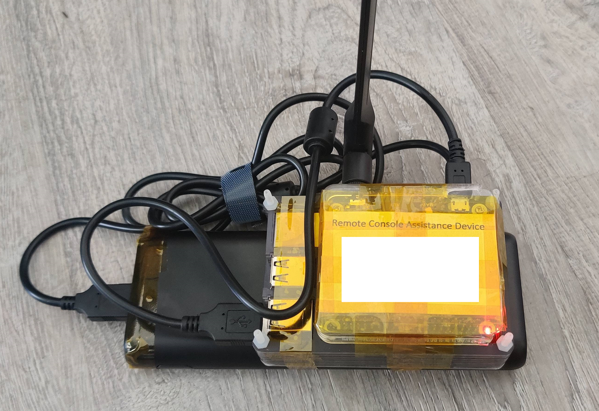
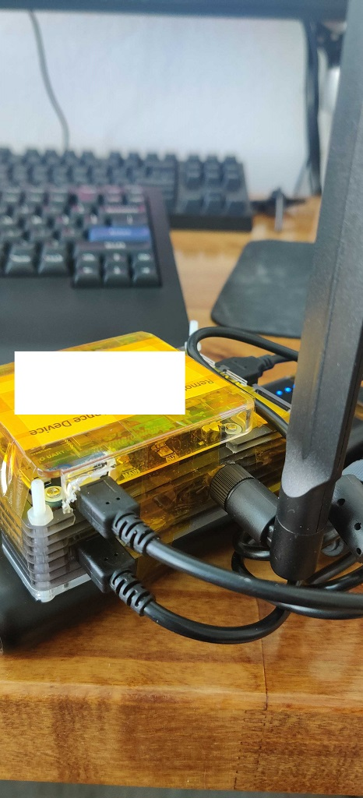
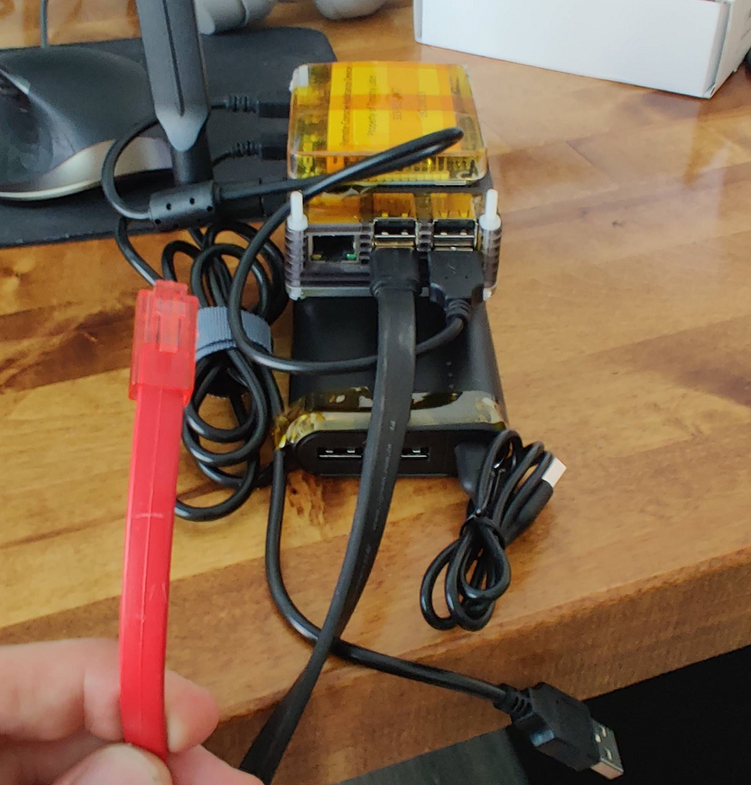

## Goal
To get remote console and network access to devices where normal remote access is unavailable using a sim card.



## Hardware Used
* Raspberry Pi
* Waveshare 4G HAT - https://www.waveshare.com/sim7600g-h-4g-hat.htm
* Activated Data only sim card through Google Fi
* Sim card adapter (tiny sim card to full sized)
* USB Battery Pack - Anker PowerCore 20100mAh (supplied 4.8A output)- https://www.anker.com/products/variant/powercore-20100/A1271012
* A case - I used an old one I had around and cut it up a bit.
* USB to Serial adapter - This one seems to have a genuine FTDI chip - https://www.amazon.com/gp/product/B00QUZY4JC/ref=ppx_yo_dt_b_search_asin_title?ie=UTF8&psc=1
* Console cable of your choice.

### Notes
I am in the US and using a data only sim through Google Fi (tmobile). You must activate the sim card before hand.
Regarding the wireguard config, I included an example for the Pi; however, you must configure the server. I am not going to cover this as there are plenty of other guides out there. A perk to Google Fi is I can enable/disable the data sim from the Google Fi app on my phone which helps keep the bill down. Also to bootstrap this, I connected directly to the serial headers on the Pi with an FT232 board; however, this access method does not work with the 4g hat as it uses these ports. You will need to access the Pi via SSH over the ethernet port or plug in with a keyboard/monitor.

### Case
I could not find a Pi case big enough to hold the Pi and Hat so I ended up hacking something together with what I had laying around. I also remove the Pi's audio port to make room for the 4g Antenna as shown on the side of the case.

### Wiring
The 4g hat has multiple configurations available. I have the antenna wired to 'main' and the jumpers in the default posistion (B).
The USB port "UART" is unused and I have a usb cable connecting the HAT's "USB" port to the Pi's USB port. There may be a way to remove this cable but I have not figured out how yet.



### Software Used
* Raspbian
* Wireguard
* Screen
* UDHCPC and QMI utils to use the GSM Hat

### Dependencies
```
sudo apt-get update && sudo apt-get install libqmi-utils udhcpc raspberrypi-kernel-headers wireguard wireguard-dkms screen

```

### Disable console access
The 4g hat needs the serial headers. You must disable them for console access.
```
sudo raspi-config
Option 6 (Interfacing Options)
Option P6 (Serial)

Disable shell access over serial.
```

### QMI Network Config
### /etc/qmi-network.conf

```
# APN h2g2 is for Google Fi.
APN=h2g2
PROXY=yes
```

### Testing the 4g card is on the network.
```
Manufacturer:
qmicli -p -d /dev/cdc-wdm0 --dms-get-manufacturer

Check IMEI:
qmicli -p -d /dev/cdc-wdm0 --dms-get-ids

Check Model:
qmicli -p -d /dev/cdc-wdm0 --dms-get-model

Check SIM status:
qmicli -p -d /dev/cdc-wdm0 --uim-get-card-status

Check firmware:
qmicli -p -d /dev/cdc-wdm0 --dms-get-revision

```

### Shell script to bring the 4g module online and get an IP.
### /usr/start_4g.sh
This script turns on the 4g module. The wwan0 interface MUST be down before qmi-network runs.
```
#!/bin/sh
/bin/ip link set wwan0 up
# Turn the module on
/usr/bin/qmicli -d /dev/cdc-wdm0 --dms-set-operating-mode='online'
/bin/sleep 5
/bin/ip link set wwan0 down
/bin/sleep 3
/bin/ip link set wwan0 down
# Bring the interface up using the settings in /etc/qmi-network.conf
/usr/bin/qmi-network /dev/cdc-wdm0 start
# Get an IP over the 4g Network.
/sbin/udhcpc -i wwan0
```

### /etc/systemd/system/4g.service
Settings are to enable service at the very end of bootup.
```
[Unit]
Description=Enable 4G
After=sysinit.target
StartLimitIntervalSec=0

[Service]
Type=idle
Restart=no
User=root
ExecStart=/usr/start_4g.sh

[Install]
WantedBy=multi-user.target
```

### Permissions and Systemd
```
sudo chmod +x /usr/start_4g.sh
sudo chmod 664 /etc/systemd/system/4g.service
# daemon-reload must be rerun if you change your script/systemd config file.
sudo systemctl daemon-reload
# Tell Systemd to run the service at bootup.
sudo systemctl enable 4g.service
```

### Wireguard Config (sanitized)
/etc/wireguard/wg.conf
```
[Interface]
PrivateKey = 
Address = 
DNS = 8.8.4.4

[Peer]
PublicKey = 
AllowedIPs = 0.0.0.0/0
Endpoint = 
PersistentKeepalive = 15
```

### Enable Wireguard at boot
```
sudo systemctl enable wg-quick@wg0
```

### Testing
At this point, if all is well your Pi has a public IP over 4g and is VPNing back to your server using wireguard. You should now be able to access the Pi remotely and use a terminal program of your choice to access the serial port.


```
screen /dev/ttyUSB0 9600
```
