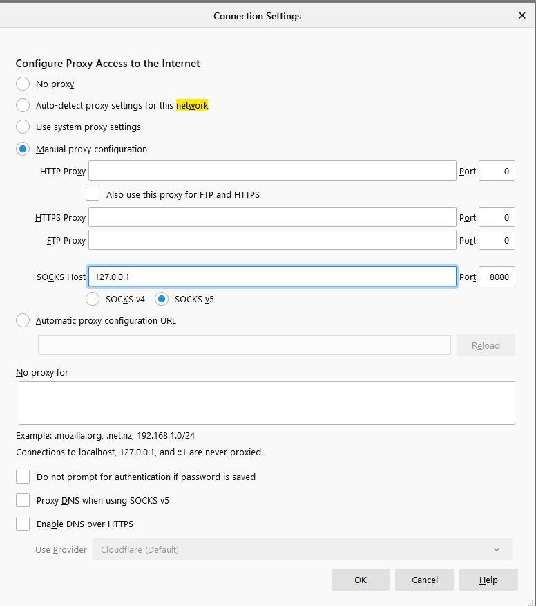

## Goal
To get remote console and network access to devices where normal remote access is unavailable using a sim card. 
* Device turns on
* Gets IP from cell network
* Wireguards to VPN server.
* Team SSHs to Pi through Wireguard and accesses console ports and network.


### Hardware Used
* Raspberry Pi
* Waveshare 4G HAT - https://www.waveshare.com/SIM7600G-H-4G-HAT.htm (I am using the global version)
* Activated Data only sim card through Google Fi
* Sim card adapter (tiny sim card to full sized)
* USB Battery Pack - Anker PowerCore 20100mAh (supplied 4.8A output)- https://www.anker.com/products/variant/powercore-20100/A1271012
* A case - I used an old one I had around and cut it up a bit.
* USB to Serial adapter - This one seems to have a genuine FTDI chip - https://www.amazon.com/gp/product/B00QUZY4JC/ref=ppx_yo_dt_b_search_asin_title?ie=UTF8&psc=1
* Console cable of your choice.

### Resources:
* Waveshare Wiki - https://www.waveshare.com/wiki/SIM7600A-H_4G_HAT
* Telnyx Blog Post - https://developers.telnyx.com/docs/v2/wireless/tutorials/sim7600
* RPI Form Post - https://www.raspberrypi.org/forums/viewtopic.php?p=1374909#p1450784
* IP Command Cheatsheet - https://access.redhat.com/sites/default/files/attachments/rh_ip_command_cheatsheet_1214_jcs_print.pdf

### Notes
I am in the US and using a data only sim through Google Fi (tmobile). You must activate the sim card before hand.
Regarding the wireguard config, I included an example for the Pi; however, you must configure the server. I am not going to cover this as there are plenty of other guides out there. A perk to Google Fi is I can enable/disable the data sim from the Google Fi app on my phone which helps keep the bill down. Also to bootstrap this, I connected directly to the serial headers on the Pi with an FT232 board; however, this access method does not work with the 4g hat as it uses these ports (I could RX but not TX). You will need to access the Pi via SSH over the ethernet port or plug in with a keyboard/monitor. Contrary to Waveshare's documentation, I do not need to push the power button or bridge PWR/GND. There is a command available (below) to power the board on instead.

### Case
I could not find a Pi case big enough to hold the Pi and Hat so I ended up hacking something together with what I had laying around. I also remove the Pi's audio port to make room for the 4g Antenna as shown on the side of the case. A little hot glue and the retaining screw is holding it in place.

### Wiring
I have the antenna wired to 'main' and the jumpers in the default posistion (B).
The USB port "UART" is unused and I have a usb cable connecting the HAT's "USB" port to the Pi's USB port. There may be a way to remove this cable but I have not figured out how yet.


### Software Used
* Raspbian
* Wireguard
* Screen
* UDHCPC and QMI utils to use the GSM Hat

### Dependencies
```
sudo apt-get update && sudo apt-get install libqmi-utils udhcpc raspberrypi-kernel-headers wireguard wireguard-dkms screen

```

### Disable console access
The 4g hat needs the serial headers. You must disable them for console access.
```
sudo raspi-config
Option 6 (Interfacing Options)
Option P6 (Serial)

Disable shell access over serial.
```

### QMI Network Config
### /etc/qmi-network.conf

```
# APN h2g2 is for Google Fi.
APN=h2g2
PROXY=yes
```

### Testing the 4g card is on the network.
```
Manufacturer:
qmicli -p -d /dev/cdc-wdm0 --dms-get-manufacturer

Check IMEI:
qmicli -p -d /dev/cdc-wdm0 --dms-get-ids

Check Model:
qmicli -p -d /dev/cdc-wdm0 --dms-get-model

Check SIM status:
qmicli -p -d /dev/cdc-wdm0 --uim-get-card-status

Check firmware:
qmicli -p -d /dev/cdc-wdm0 --dms-get-revision

```

### Shell script to bring the 4g module online and get an IP.
### /usr/start.sh
This script turns on the 4g module. The wwan0 interface MUST be down before qmi-network runs. Thank you @Pintovski on RPI Forums. Google's APN is hg2g. Change that value in the script below if you're on another carrier.

```
#!/bin/bash
LOG_PATH="/home/pi/4G.log"
sim7600_4G_hat_init_PATH = "/home/pi"
MAX_TRIES=2

N_TRY=0
TRY=""

echo "Logs go to: $LOG_PATH"
rm $LOG_PATH

echo "---------------------------------" > "$LOG_PATH"
echo "Connecting 4G-LTE" >> "$LOG_PATH"
echo "-check hat net led---------------" >> "$LOG_PATH"
echo "-sim7600_4G_hat_ini--------------" >> "$LOG_PATH"

echo "$LOG_PATH"
echo "---------------------------------"
echo "Connecting 4G-LTE"
echo "-check hat net led---------------"
echo "-sim7600_4G_hat-ini--------------"

sh "$sim7600_4G_hat_init_PATH" >> "$LOG_PATH"

while [ "$TRY" != "done" ]
do
   N_TRY=$((N_TRY + 1))

   echo "--try $N_TRY --" >> "$LOG_PATH"
   echo "--try $N_TRY --"

   echo "--dms SET operating mode--" >> "$LOG_PATH"
   echo "--dms SET operating mode--"

   sudo qmicli -d /dev/cdc-wdm0 --dms-set-operating-mode='online' >> "$LOG_PATH"

   echo "--dms GET operating mode--" >> "$LOG_PATH"
   echo "--dms GET operating mode--"

   sudo qmicli -d /dev/cdc-wdm0 --dms-get-operating-mode >> "$LOG_PATH"

   if [ "$N_TRY" = "$MAX_TRIES" ]
   then

      echo "reached MAX_TRIES = $MAX_TRIES" >> "$LOG_PATH"
      echo "reached MAX_TRIES = $MAX_TRIES"

      TRY="done"
   fi
   temp="$(grep -c "online" "$LOG_PATH")"

   if [ $temp -eq 1 ]
   then
      echo "Success! <0.0>" >> "$LOG_PATH"
      grep "online" "$LOG_PATH" >> "$LOG_PATH"

      echo "Success! <0.0>"
      grep "online" "$LOG_PATH"

      TRY="done"
   fi
done

echo "Needed $N_TRY tries to connect" >> "$LOG_PATH"
echo "-get-signal-strength-------------" >> "$LOG_PATH"

echo "Needed $N_TRY tries to connect"
echo "-get-signal-strength-------------"


sudo qmicli -d /dev/cdc-wdm0 --nas-get-signal-strength >> "$LOG_PATH"

tail -14 "$LOG_PATH"

echo "-get-home-network----------------" >> "$LOG_PATH"

echo "-get-home-network----------------"

sudo qmicli -d /dev/cdc-wdm0 --nas-get-home-network >> "$LOG_PATH"

echo "- -w ----------------------------" >> "$LOG_PATH"

echo "- -w ----------------------------"

sudo qmicli -d /dev/cdc-wdm0 -w >> "$LOG_PATH"

echo "-wwan0 down----------------------" >> "$LOG_PATH"

echo "-wwan0 down----------------------"

sudo ip link set wwan0 down >> "$LOG_PATH"

echo "-raw_ip -> Y---------------------" >> "$LOG_PATH"

echo "-raw_ip -> Y---------------------"

echo 'Y' | sudo tee /sys/class/net/wwan0/qmi/raw_ip >> "$LOG_PATH"

echo "-wwan0 up------------------------" >> "$LOG_PATH"

echo "-wwan0 up------------------------"

sudo ip link set wwan0 up >> "$LOG_PATH"

echo "-get-autoconnect-settings--------" >> "$LOG_PATH"

echo "-get-autoconnect-settings--------"

sudo qmicli -d /dev/cdc-wdm0 --wds-get-autoconnect-settings >> "$LOG_PATH"

echo "-set-autoconnect-settings--------" >> "$LOG_PATH"

echo "-set-autoconnect-settings--------"

sudo qmicli -d /dev/cdc-wdm0 --wds-set-autoconnect-settings=disabled >> "$LOG_PATH"

tail -2 "$LOG_PATH"

echo "if error 26 -> its ok. It means that autoconnect was already disabled" >> "$LOG_PATH"
echo "-start network-------------------" >> "$LOG_PATH"

echo "if error 26 -> its ok. It means that autoconnect was already disabled"
echo "-start network-------------------"

N_TRY=0
TRY=""
while [ "$TRY" != "done" ]
do
   N_TRY=$((N_TRY + 1))

   echo "--try $N_TRY --" >> "$LOG_PATH"
   echo "--try $N_TRY --"

# CHANGE THIS NEXT LINE TO MATCH YOUR COMMUNICATION PROVIDER
   sudo qmicli -p -d /dev/cdc-wdm0 --device-open-net='net-raw-ip|net-no-qos-header' --wds-start-network="apn='hg2g',ip-type=4" --client-no-release-cid >> "$LOG_PATH"

   if [ "$N_TRY" = "$MAX_TRIES" ]
   then

      echo "reached MAX_TRIES = $MAX_TRIES" >> "$LOG_PATH"
      echo "reached MAX_TRIES = $MAX_TRIES"

      TRY="done"
   else
      echo "...$N_TRY of $MAX_TRIES: unable to start network. Trying again in 5s."
      sleep 5
   fi
   temp="$(grep -c "\[/dev/cdc-wdm0\] Network started" "$LOG_PATH")"

   if [ $temp -eq 1 ]
   then
      echo "...$N_TRY of $MAX_TRIES: Success!" >> "$LOG_PATH"
      grep "\[/dev/cdc-wdm0\] Network started" "$LOG_PATH" >> "$LOG_PATH"

      echo "...$N_TRY of $MAX_TRIES: Success!"
      grep "\[/dev/cdc-wdm0\] Network started" "$LOG_PATH"

      TRY="done"
   fi
done

echo "network started ?"
echo "network started ?" >> "$LOG_PATH"

echo "-start---------------------------" >> "$LOG_PATH"

echo "-start---------------------------"

sudo qmi-network /dev/cdc-wdm0 start >> "$LOG_PATH"

echo "-udhcpc--------------------------" >> "$LOG_PATH"

echo "-udhcpc--------------------------"

sudo udhcpc -t 10 -i wwan0 >> "$LOG_PATH"

echo "-ip a s--------------------------" >> "$LOG_PATH"

echo "-ip a s--------------------------"

ip a s wwan0 >> "$LOG_PATH"

echo "-ip r s--------------------------" >> "$LOG_PATH"

echo "-ip r s--------------------------"

ip r s >> "$LOG_PATH"

echo "-ifconfig------------------------" >> "$LOG_PATH"
echo "ifconfig" >> "$LOG_PATH"
echo "---------------------------------" >> "$LOG_PATH"
ifconfig wwan0

ifconfig >> "$LOG_PATH"

echo "-manufacturer--------------------" >> "$LOG_PATH"
sudo qmicli --device=/dev/cdc-wdm0 --device-open-proxy --dms-get-manufacturer >> "$LOG_PATH"

echo "-model---------------------------" >> "$LOG_PATH"
sudo qmicli --device=/dev/cdc-wdm0 --device-open-proxy --dms-get-model >> "$LOG_PATH"

echo "-firmware------------------------" >> "$LOG_PATH"
sudo qmicli --device=/dev/cdc-wdm0 --device-open-proxy --dms-get-revision >> "$LOG_PATH"

echo "-IMEI----------------------------" >> "$LOG_PATH"
sudo qmicli --device=/dev/cdc-wdm0 --device-open-proxy --dms-get-ids >> "$LOG_PATH"

echo "-SIM-status----------------------" >> "$LOG_PATH"
sudo qmicli --device=/dev/cdc-wdm0 --device-open-proxy --uim-get-card-status >> "$LOG_PATH"

echo "-qmicli version------------------" >> "$LOG_PATH"
sudo qmicli --version >> "$LOG_PATH"

echo "-final-testing-------------------" >> "$LOG_PATH"
sudo ping -c 1 -I wwan0 8.8.8.8 >> "$LOG_PATH"

echo "-final-testing-------------------"
#sudo ping -c 1 -I wwan0 8.8.8.8
tail -7 "$LOG_PATH"

```

### Script to check that Pi is still connected and rerun the script if the connection dies.
/usr/check.sh
```
#!/bin/bash
TURN_ON_SCRIPT_PATH="/usr/start.sh"
inet_count="$(ifconfig wwan0 | grep -c 'inet ')"

if [ $inet_count -eq 1 ]
then
  echo "-> wwan0 is connected."
else
  echo "-> wwan0 is offline."
  sudo sh "$TURN_ON_SCRIPT_PATH"
fi
```

### Crontab
As pi crontab user have the script run at boot:
```
sudo chmod +x /usr/start.sh
sudo chmod +x /usr/check.sh
crontab -e
@reboot /usr/start.sh
2 * * * * /usr/check.sh
```

### Wireguard Config (sanitized)
/etc/wireguard/wg0.conf
```
[Interface]
PrivateKey = 
Address = 
DNS = 8.8.4.4

[Peer]
PublicKey = 
AllowedIPs = 0.0.0.0/0
Endpoint = 
PersistentKeepalive = 15
```

### Enable Wireguard at boot
```
sudo systemctl enable wg-quick@wg0
```

### Testing
At this point, if all is well your Pi has a public IP over 4g and is VPNing back to your server using wireguard. You should now be able to access the Pi remotely and use a terminal program of your choice to access the serial port.


### Access Console Port
* Find the device with dmesg
* You can close out of screen with CTRL-A Z

```
screen /dev/ttyUSB0 9600
```

### Network Access
You can also take advantage of SSH to get access over the sim card to the ethernet port of the Pi. Example, "you need to bootstrap a web based firewall through the management port but it's not online yet".

```
# Set static IP on Pi
ip link set eth0 down
ip addr add 192.168.1.10/24 dev eth0
ip link set eth0 up

# From your workstation
ssh -D 8080 <ip of pi>

# Change Firefox to use Socks proxy.
# You can now access anything on the LAN side of the Pi
http://192.168.1.99
```
### Firefox Settings:

